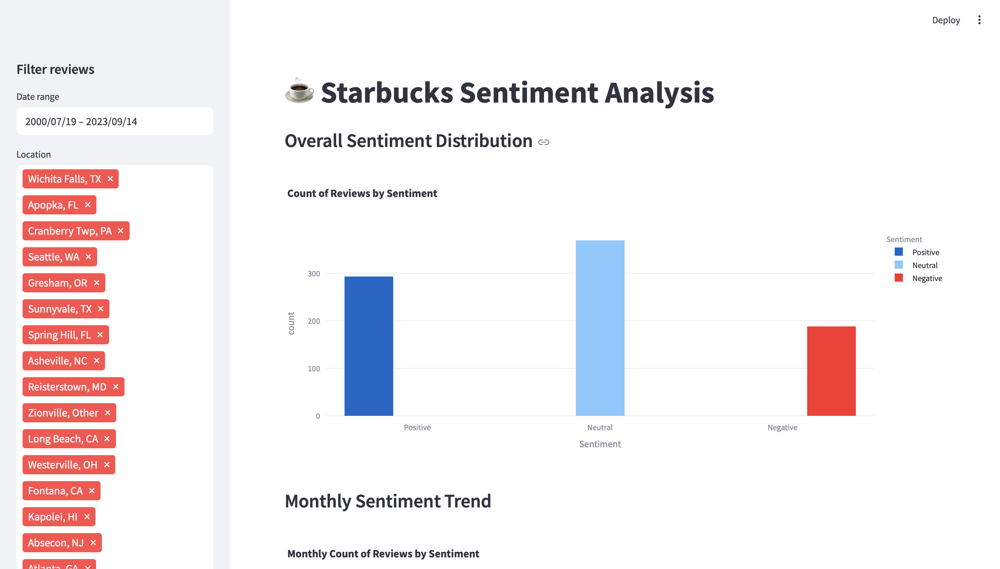

# Starbucks Sentiment Analysis Dashboard

A Streamlit-powered web app that applies NLP techniques to customer reviews of Starbucks, classifies sentiment, and offers interactive visualizations and review browsing—complete with embedded images when available.

---

## 📁 Repository Structure

```
Starbucks_Sentiment_Analysis/
│
├── data/
│   └── Starbucks_reviews_data.csv       # Raw review dataset (name,location,Date,Rating,Review,Image_Links)
│
├── dashboard/
│   ├── streamlit_app.py                # Main Streamlit application
│   └── static/
│       └── screenshot.png              # Demo screenshot used below
│
├── notebooks/
│   └── 1_sentiment_analysis.ipynb      # Exploratory data analysis, cleaning & sentiment labeling
│
├── requirements.txt                    # Python package dependencies
└── README.md                           # This file
```

---

## ✨ Key Features

* **Automated Sentiment Scoring**
  Uses TextBlob to compute a polarity score for each review, then classifies it as **Positive**, **Neutral**, or **Negative**.
* **Interactive Sidebar Filters**
  • Date-range picker
  • Location multiselect
  • Sentiment multiselect
* **Dynamic Visualizations**
  • Bar chart of overall sentiment distribution
  • Line chart of monthly sentiment trends
  • Word cloud of the most frequent words in filtered reviews
* **Review Gallery**
  Displays a sampling of filtered reviews (up to 5 at a time), including reviewer name, location, date, sentiment label, full text, and any attached images.

---

## 📷 Demo



---

## 🚀 Getting Started

### 1. Clone the repository

```bash
git clone https://github.com/yourusername/Starbucks_Sentiment_Analysis.git
cd Starbucks_Sentiment_Analysis
```

### 2. Set up a virtual environment (recommended)

```bash
python3 -m venv .venv
source .venv/bin/activate       # macOS/Linux
.\.venv\Scripts\activate        # Windows
```

### 3. Install dependencies

```bash
pip install -r requirements.txt
```

### 4. Prepare your data

Ensure your CSV with columns `name, location, Date, Rating, Review, Image_Links` is located at:

```
data/Starbucks_reviews_data.csv
```

### 5. Run the Streamlit dashboard

```bash
streamlit run dashboard/streamlit_app.py
```

Open your browser to `http://localhost:8501` to explore the app.

---

## 🛠️ How It Works

1. **Data Loading & Caching**

   * The `@st.cache_data` decorator speeds up reloads by caching the DataFrame.
2. **Date Parsing**

   * Strips the `"Reviewed "` prefix from the Date column and converts to `datetime`.
3. **Sentiment Analysis**

   * `TextBlob(review).sentiment.polarity` yields a score in \[–1, 1].

     * Polarity > 0.1 → **Positive**
     * Polarity < –0.1 → **Negative**
     * Otherwise → **Neutral**
4. **Filtering Logic**

   * Sidebar inputs generate a boolean mask to subset the data.
5. **Visualizations**

   * Plotly Express produces interactive bar and line charts.
   * WordCloud generates a frequency-based image of top words.
6. **Review Gallery**

   * Randomly samples up to 5 reviews from the filtered set, displays text plus any images.

---

## 📦 Dependencies

Managed in `requirements.txt`:

* streamlit
* pandas
* textblob
* plotly
* wordcloud

Install all with:

```bash
pip install -r requirements.txt
```

---

## 🤝 Contributing

1. Fork the repository
2. Create a feature branch:

   ```bash
   ```

git checkout -b feature/YourFeatureName

````
3. Commit your changes:  
   ```bash
git commit -m "Add awesome new feature"
````

4. Push to your fork:

   ```bash
   ```

git push origin feature/YourFeatureName

```


## 📄 License

This project is licensed under the MIT License. See the [LICENSE](LICENSE) file for details.

---


